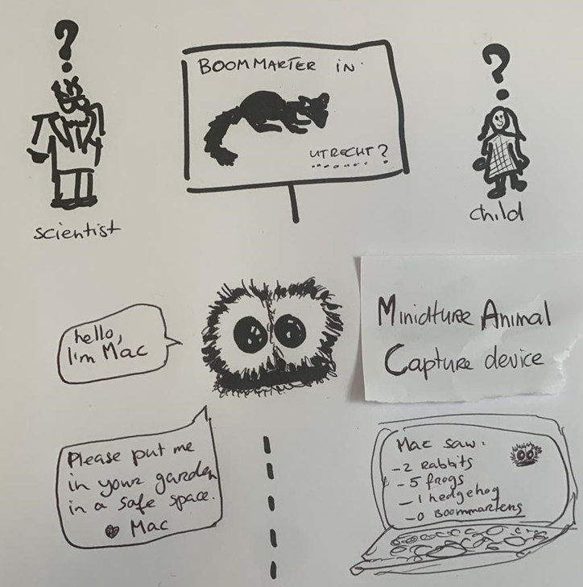

# arise-hackathon-2022

Our ARISE 2022 hackathon submission: the Cameratrap Research Citizen Science Network, aka CRCSN.

Driven by MAC, our Miniature Animal Capture device (implementing Cute AI™), this network allows scientists and citizens working together on ecological research in urban areas.

Hackathon team: VAART software (Jorrit & Jasper) + JADS (Arjan & Robin).

## Mockup
Download the mockup (pdf):  

https://vaartsoftware.nl

https://jads.nl
